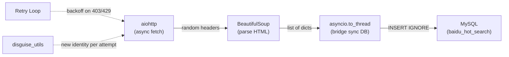

# Baidu Hot Search Data Pipeline — Complete Knowledge Library

> **Project:** `baidu_da/`  
> **Timeline:** Feb 2026  
> **Scope:** HTTP fundamentals → Web scraping → Anti-detection → Async concurrency → MySQL integration → Production pipeline

---

## 1. Project Architecture (Final State)

```
baidu_da/
├── config/
│   └── db_config.ini              # MySQL credentials (host, port, user, password, database, charset)
├── utils/
│   ├── disguise_utils.py          # Random header generator (fake_useragent + Sec-Fetch-*)
│   ├── proxy_mgr.py               # Proxy rotation (placeholder for residential IPs)
│   └── mysql_helper.py            # Singleton connection pool + transaction context manager
├── scrapers/
│   ├── baidu_hotsearch.py         # Day 7: Sync scraper (requests + BeautifulSoup)
│   ├── baidu_async.py             # Day 8: Async version (aiohttp + ClientSession)
│   ├── deep_scrape.py             # Day 8: Concurrent detail-page fetching (asyncio.gather)
│   ├── stealth_scrape.py          # Day 9: Proxy + disguise integration
│   ├── smart_scrape.py            # Day 9: Retry + exponential backoff
│   └── baidu_pipe.py              # FINAL: Full ETL pipeline combining all components
├── database/
│   └── schema.sql                 # Table definitions (students, baidu_hot_search)
└── tests/
    ├── pooled_conn_test.py        # Singleton + connection pool validation
    └── cont_manager_test.py       # Transaction rollback test
```

### Data Flow



---

## 2. Knowledge Points by Topic

### 2.1 HTTP Fundamentals (★★★★★)

| Concept | What It Is | Why It Matters for Scraping |
|---|---|---|
| **HTTP/HTTPS** | Rules for web communication. HTTPS = encrypted | All scraping starts with HTTP requests |
| **Request** | Client → Server ("Give me this page") | Your Python script sends these |
| **Response** | Server → Client (HTML + status code) | What you parse for data |
| **Headers** | Metadata on the "envelope" (User-Agent, Referer, Accept-Language) | Servers inspect these to detect bots |
| **User-Agent** | String identifying the client ("Chrome on Mac" vs "python-requests") | **#1 reason** scrapers get blocked |
| **Status Codes** | Server's "mood": `200` OK, `403` Forbidden, `429` Rate Limited, `418` I'm a Teapot | Determines retry strategy |

**Key Lesson:** Default Python UA (`python-requests/2.31.0`) = instant ban. Always set a realistic UA.

### 2.2 HTML Parsing — BeautifulSoup & CSS Selectors (★★★★☆)

| Concept | Syntax | Example |
|---|---|---|
| **DOM Tree** | HTML = nested tree of tags | `<html> → <body> → <div> → <span>` |
| **Tag** | The element type | `<div>`, `<span>`, `<a>`, `<h1>` |
| **Class** | A label/name on an element | `.category-wrap_iQLoo` |
| **ID** | Unique identifier | `#main-content` |
| **[select()](file:///Users/iversonchen/Documents/Work_Experience/baidu_da/utils/mysql_helper.py#50-57)** | Find ALL matching elements → returns list | `soup.select(".hot-index_1Bl1a")` |
| **`select_one()`** | Find FIRST matching element → returns single item | `item.select_one("a")` |
| **`get_text(strip=True)`** | Extract text content, remove whitespace | `"  Hot Topic  "` → `"Hot Topic"` |
| **`['href']`** | Extract an HTML attribute value | `item.select_one("a")["href"]` → URL |

**CSS Selector Syntax:**
- `span.title-content-title` = `<span>` with class `title-content-title`
- `.category-wrap_iQLoo` = any element with that class
- `a` = all `<a>` (link) tags

### 2.3 Async Programming (★★★★★)

| Concept | What It Does | Analogy |
|---|---|---|
| **Synchronous** | Do task 1, wait, do task 2, wait... | One person ordering 100 coffees one at a time |
| **Asynchronous** | Start task 1, while waiting start task 2... | One person ordering, sitting down, buzzer rings when ready |
| **`async def`** | Declares a coroutine (pauseable function) | A "recipe" that can be paused mid-step |
| **`await`** | Pauses current task, lets Event Loop do others | The "buzzer" — wakes you when data arrives |
| **Event Loop** | The manager that juggles all paused tasks | A chef checking which oven is ready next |
| **`asyncio.run()`** | Starts the Event Loop and runs a coroutine | The "ignition key" — no run, no async |
| **`aiohttp.ClientSession`** | Async HTTP client with connection pooling | A browser tab that stays open for reuse |
| **`asyncio.gather(*tasks)`** | Run multiple coroutines concurrently | "Start all engines at once" |
| **Semaphore** | Limits concurrent tasks (e.g., max 5) | A museum turnstile — 5 in at a time |

**When to use async:** Multiple concurrent I/O operations (fetching 30+ pages). **Not** for single sequential pipelines — adds complexity with zero speed gain.

**Critical Distinction:**
- `time.sleep(2)` → Freezes **entire program**. Never use in async code.
- `await asyncio.sleep(2)` → Only pauses **this task**. Event Loop handles others.

**`async with` explained:**
- `with` = Context Manager (auto-opens and auto-closes resources safely)
- `async with` = Same, but the open/close involves async I/O (network connections)

### 2.4 Anti-Detection & Stealth (★★★★☆)

| Defense Layer | Technique | Implementation |
|---|---|---|
| **Header Rotation** | Random UA + Referer + Sec-Fetch-* per request | [disguise_utils.py](file:///Users/iversonchen/Documents/Work_Experience/baidu_da/utils/disguise_utils.py) with `fake_useragent` |
| **Rate Limiting** | Random delay between requests | `await asyncio.sleep(random.uniform(1, 3))` |
| **Exponential Backoff** | Double wait time on each retry | `wait = (2 ** (attempt + 1)) + random.uniform(1, 3)` |
| **Proxy Rotation** | Different IP per request | Pass `proxy=` to `session.get()` |
| **Semaphore** | Cap concurrent requests | `asyncio.Semaphore(5)` |

**WAF (Web Application Firewall):** The "bouncer" that checks every request. Inspects IP rate, header fingerprints, and TLS signatures.

**TLS Fingerprinting:** Even with perfect headers, Python's HTTPS "handshake" differs from Chrome's. Advanced sites detect this at the protocol level. Fix: `httpx` or browser automation (Playwright).

### 2.5 Database Integration (★★★★★)

| Concept | What It Does | Why It Matters |
|---|---|---|
| **Singleton Pattern** | Only one [MysqlHelper](file:///Users/iversonchen/Documents/Work_Experience/baidu_da/utils/mysql_helper.py#7-112) instance ever created | Prevents multiple connection pools wasting resources |
| **Connection Pooling** | Pre-opened DB connections ready to use | Like `aiohttp.ClientSession` but for MySQL |
| **[transaction()](file:///Users/iversonchen/Documents/Work_Experience/baidu_da/utils/mysql_helper.py#93-112)** | Context manager: auto-commit on success, auto-rollback on failure | All-or-nothing batch safety |
| **`INSERT IGNORE`** | Silently skip rows that violate UNIQUE constraints | Idempotency — safe to re-run |
| **`UNIQUE KEY (title, created_at)`** | Only one entry per title per day | Prevents duplicate data |
| **`utf8mb4`** | Full Unicode support (emoji 🔥 = 4 bytes) | Old `utf8` crashes on emoji |
| **Parameterized queries (`%s`)** | Placeholder values prevent SQL injection | Security: never concatenate user data into SQL |
| **`CURDATE()`** | MySQL function for today's date | Let the DB handle date consistently |

### 2.6 `asyncio.to_thread()` — Bridging Sync & Async (★★★★★)

When you have sync libraries (like `pymysql`) in an async codebase, wrapping them in `asyncio.to_thread()` runs them in a thread pool without blocking the event loop. Very common production pattern.

```python
def _insert():
    with db.transaction() as cursor:
        for item in data_list:
            cursor.execute(sql, params)

await asyncio.to_thread(_insert)
```

### 2.7 Module Execution: `python -m` (★★★★☆)

| Command | Import root | Cross-package imports |
|---|---|---|
| `python3 scrapers/baidu_pipe.py` | `scrapers/` | ❌ Breaks |
| `python -m scrapers.baidu_pipe` | Project root | ✅ Works |

**Rule:** Always use `-m` when your script imports from sibling packages.

---

## 3. Mistakes & Lessons Learned

| # | Mistake | Root Cause | Lesson |
|---|---|---|---|
| 1 | `for attempt in range(retries = 3):` | `range()` doesn't accept keyword args | Use function parameter: `def func(retries=3):` then `range(retries)` |
| 2 | `hot_index_el` vs `hot_idx_el` typo | Inconsistent variable abbreviation | Python won't catch undefined vars until runtime hits that line |
| 3 | Code outside function (wrong indentation) | `await` call at module level | In Python, indentation = scope. Code outside the function body runs on import |
| 4 | [_insert()](file:///Users/iversonchen/Documents/Work_Experience/baidu_da/scrapers/baidu_pipe.py#88-99) returns `None` but `print(result)` used | Function missing `return` statement | Always match return values with how they're consumed |
| 5 | `count += 1` for INSERT IGNORE | Counts attempts, not actual inserts | Use `count += cursor.execute(...)` — returns 0 for ignored duplicates, 1 for inserted |
| 6 | Second run returned "No data scraped" | Baidu anti-bot served stripped HTML | HTTP 200 ≠ success. Always validate content, not just status code |
| 7 | `if data_list:` catches both `None` and `[]` | Python truthiness rules | Distinguish: `if data_list:` / `elif data_list is None:` / `else:` (empty list) |

---

## 4. Debugging Strategy (Real-World Pattern)

When the scraper returned 0 items despite HTTP 200, the debugging approach was:

1. **Add prints at each stage** → Found items: 0, Parsed: 0 → Pinpointed that parsing found nothing
2. **Save raw HTML** → `with open('debug_response.html', 'w') as f: f.write(html_content)` → Inspect what server actually returned
3. **Distinguish error types** → `None` (network error) vs `[]` (CSS selectors broke) vs data (success)
4. **Root cause:** Baidu served a different (stripped) page after detecting repeated requests from same IP

---

## 5. Key Python Patterns Learned

| Pattern | Where Used | Description |
|---|---|---|
| **Singleton** | `MysqlHelper.__new__()` | Single instance, single connection pool |
| **Context Manager** | `with db.transaction() as cursor:` | Auto commit/rollback, auto resource cleanup |
| **`enumerate(items, 1)`** | Scraper loop | Index + item in one shot, starting from 1 |
| **`async with`** | `aiohttp.ClientSession`, `session.get()` | Safe async resource management |
| **Inner function + `to_thread`** | [to_db()](file:///Users/iversonchen/Documents/Work_Experience/baidu_da/scrapers/baidu_pipe.py#76-100) | Bridge sync code into async pipeline |
| **Exponential backoff** | [smart_scrape.py](file:///Users/iversonchen/Documents/Work_Experience/baidu_da/scrapers/smart_scrape.py), [baidu_pipe.py](file:///Users/iversonchen/Documents/Work_Experience/baidu_da/scrapers/baidu_pipe.py) | `2^n + jitter` retry strategy |
| **`if __name__ == "__main__":`** | All scripts | Prevents code running on import |

---

## 6. Final Pipeline Code Reference ([baidu_pipe.py](file:///Users/iversonchen/Documents/Work_Experience/baidu_da/scrapers/baidu_pipe.py))

The final script combines all components:

- **Imports:** `asyncio`, `aiohttp`, [random](file:///Users/iversonchen/Documents/Work_Experience/baidu_da/utils/disguise_utils.py#5-18), `BeautifulSoup`, [get_random_headers](file:///Users/iversonchen/Documents/Work_Experience/baidu_da/utils/disguise_utils.py#5-18), [MysqlHelper](file:///Users/iversonchen/Documents/Work_Experience/baidu_da/utils/mysql_helper.py#7-112)
- **[scrape_baidu_hot_search(retries=3)](file:///Users/iversonchen/Documents/Work_Experience/baidu_da/scrapers/baidu_pipe.py#9-74):** Async fetch with retry loop, exponential backoff, random delay, null-safe parsing, returns `list[dict]`
- **[to_db(data_list)](file:///Users/iversonchen/Documents/Work_Experience/baidu_da/scrapers/baidu_pipe.py#76-100):** `INSERT IGNORE` via `MysqlHelper.transaction()`, bridged with `asyncio.to_thread()`
- **[main()](file:///Users/iversonchen/Documents/Work_Experience/baidu_da/scrapers/baidu_pipe.py#102-111):** Orchestrator — await scrape → validate → await insert
- **Entry:** `asyncio.run(main())`

---

## 7. Production Readiness Checklist

- [x] Random headers per request (anti-detection)
- [x] Retry with exponential backoff (resilience)
- [x] `INSERT IGNORE` + UNIQUE KEY (idempotency)
- [x] Parameterized queries (SQL injection prevention)
- [x] Transaction with auto-rollback (data integrity)
- [x] Connection pooling (performance)
- [x] Null safety on all selectors (robustness)
- [x] Distinguishing None vs empty list (observability)
- [ ] Logging module (replace `print()` with `logging`)
- [ ] Scheduled execution (cron job)
- [ ] Fully async DB with `aiomysql`
- [ ] Proxy rotation with real residential IPs
