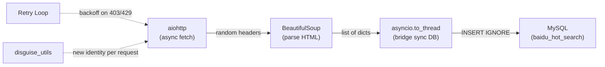

# 📚 Baidu DA Project — 2-Week Knowledge Library

> **Author:** Iverson Chen  
> **Period:** Feb 9 – Feb 26, 2026  
> **Context:** UCLA MGMTMSA 402 + Baidu Hot Search Data Pipeline

---

## 📑 Table of Contents

| Section | Topic |
|---|---|
| [Architecture](#-final-architecture) | Project structure & data flow |
| **Week 1** | |
| [Phase 1](#-phase-1-mysql-installation--server-config) | MySQL installation & config |
| [Phase 2](#-phase-2-database-design--normalization) | Normalization theory |
| [Phase 3](#-phase-3-sql-fundamentals) | DDL, DML, data types |
| [Phase 4](#-phase-4-python--mysql-pep-249) | Python DB-API & venv |
| [Phase 5](#-phase-5-connection-pooling--transactions) | Pooling, Singleton, ACID |
| [Phase 6](#-phase-6-project-organization) | Package structure |
| **Week 2** | |
| [Phase 7](#-phase-7-http-fundamentals) | HTTP basics |
| [Phase 8](#-phase-8-html-parsing) | BeautifulSoup & CSS selectors |
| [Phase 9](#-phase-9-async-programming) | asyncio & aiohttp |
| [Phase 10](#-phase-10-anti-detection--resilience) | Stealth & backoff |
| [Phase 11](#-phase-11-final-pipeline) | Full ETL pipeline |
| **Reference** | |
| [Code Patterns](#-reusable-code-patterns) | Singleton, context mgr, backoff… |
| [Mistakes](#-mistakes--lessons-learned) | 14 real debugging sessions |
| [Q&A](#-questions-i-asked--answers) | 10 gaps identified & filled |
| [Debugging](#-debugging-playbook) | Step-by-step troubleshooting |
| [Checklist](#-production-readiness) | Done ✅ vs future ☐ |

---

## 🏗 Final Architecture

```
baidu_da/
├── config/
│   └── db_config.ini           ← MySQL creds (gitignored)
├── database/
│   └── schema.sql              ← Table definitions
├── utils/
│   ├── __init__.py
│   ├── mysql_helper.py         ← Singleton pool + transactions
│   ├── disguise_utils.py       ← Random headers
│   └── proxy_mgr.py            ← Proxy rotation (placeholder)
├── scrapers/
│   ├── baidu_hotsearch.py      ← v1: Sync
│   ├── baidu_async.py          ← v2: Async
│   ├── deep_scrape.py          ← v3: Concurrent pages
│   ├── stealth_scrape.py       ← v4: + Disguise
│   ├── smart_scrape.py         ← v5: + Retry/backoff
│   └── baidu_pipe.py           ← FINAL pipeline
├── tests/
└── venv/
```

**Data flows like this:**



---

---

# 🗓 Week 1 — MySQL, Database Theory & Python Integration

---

## 🔧 Phase 1: MySQL Installation & Server Config

> ★★★★☆ — Do once, reference forever.

**Setup commands:**

```bash
brew install mysql                # Homebrew for Apple Silicon
mysql_secure_installation         # Set root password, harden security
brew services start mysql         # Start the engine
brew services restart mysql       # Apply my.cnf changes
```

**Production tuning** — edit `/opt/homebrew/etc/my.cnf`:

```ini
[mysqld]
innodb_flush_log_at_trx_commit = 1    # ⭐ Durability: flush every commit
max_connections = 1000                 # Default 151 is too low
innodb_buffer_pool_size = 18G         # RAM > disk I/O
innodb_redo_log_capacity = 2G         # Buffer for write-heavy loads
character_set_server = utf8mb4        # 4-byte UTF-8 (emoji-safe 🔥)
```

> 💡 **Why `utf8mb4`?** MySQL's legacy `utf8` only supports 3 bytes. Emoji like 🔥 needs 4 bytes and will crash without `utf8mb4`.

**Create a dedicated app user** (never use `root` in code):

```sql
CREATE USER 'baidu_da'@'localhost' IDENTIFIED BY 'Complex_Password_123!';
GRANT ALL PRIVILEGES ON *.* TO 'baidu_da'@'localhost';
FLUSH PRIVILEGES;
```

---

## 📐 Phase 2: Database Design & Normalization

> ★★★★★ — Gets asked in interviews. Core of relational thinking.

**The Normal Forms** — remember: *"The key, the whole key, and nothing but the key."*

| Form | One-Liner Rule | Example Violation |
|---|---|---|
| **1NF** | Every cell holds one value | `"LA, 555-0199"` in one column |
| **2NF** | No partial dependency on composite key | `course_name` depends only on `course_id`, not full key `(student_id, course_id)` |
| **3NF** | No column depends on another non-key column | `school_address` depends on `school_name`, not on `student_id` |
| **BCNF** | Every determinant is a superkey | Strictest — eliminates all FD redundancy |

**How to fix violations:** Extract the offending columns into their own table and link with a Foreign Key.

**Key hierarchy:**

- **Superkey** — any set of columns that uniquely identifies a row (can have extras)
- **Candidate Key** — a *minimal* superkey (remove any column and it stops working)
- **Primary Key** — the candidate key you pick (non-null, unique)

**When to normalize vs. denormalize:**

| | OLTP (MySQL) | OLAP (BigQuery) |
|---|---|---|
| Goal | Fast writes, data integrity | Fast reads, analytics |
| Design | Normalized (3NF/BCNF) | Denormalized / star schema |

---

## 📝 Phase 3: SQL Fundamentals

> ★★★★★ — You'll use this daily.

### ⚠️ The DECIMAL vs FLOAT Trap

- **`FLOAT`** = approximate → `0.1 + 0.2 = 0.30000000000000004`
- **`DECIMAL(M,D)`** = exact → `0.1 + 0.2 = 0.3`

> 🚨 **Rule:** Never use `FLOAT` for money, GPA, or measurements. Always `DECIMAL`.

### Schema example (3NF):

```sql
CREATE TABLE student (
    id INT AUTO_INCREMENT PRIMARY KEY,
    school_id INT,
    name VARCHAR(50) NOT NULL,
    age TINYINT UNSIGNED,        -- 0–255, saves space
    height_cm DECIMAL(5,2),      -- Exact: 178.50
    enrollment_date DATE,
    FOREIGN KEY (school_id) REFERENCES school(id)
);
```

### Transactions:

```sql
START TRANSACTION;
  INSERT INTO school (name, address) VALUES ('UCLA', 'Los Angeles, CA');
  INSERT INTO student (school_id, name) VALUES (1, 'Iverson Chen');
COMMIT;       -- ✅ Save permanently
-- ROLLBACK;  -- ❌ Undo everything
```

---

## 🐍 Phase 4: Python + MySQL (PEP 249)

> ★★★★★ — Standard interface for all Python DB drivers.

### How the pieces connect:

```
Your Python Code
      ↓ cursor.execute(sql)
   Cursor     ← cheap "messenger", auto-close with `with`
      ↓
  Connection   ← expensive TCP pipe, open once and reuse
      ↓
 MySQL Server
```

- Use **`DictCursor`** → rows come back as `dict` (readable), not `tuple`

### Virtual environment (mandatory on modern macOS):

```bash
python3 -m venv venv
source venv/bin/activate
pip install pymysql dbutils
```

> 💡 macOS blocks global `pip install` (PEP 668). You **must** use a venv.

### Connection config:

```python
config = {
    'host': '127.0.0.1',      # Use IP, not 'localhost' (avoids socket errors)
    'user': 'baidu_da',
    'password': 'Your_Password',
    'database': 'your_db',
    'cursorclass': pymysql.cursors.DictCursor
}
```

---

## ⚡ Phase 5: Connection Pooling & Transactions

> ★★★★★ — The jump from "works on my laptop" to production.

### Why pool connections?

- ❌ **Short connections:** Open → query → close every time = slow (TCP handshake each time)
- ✅ **Connection pool:** Pre-open N connections, reuse them = fast & controlled

### ACID — the 4 guarantees of reliable databases:

| Letter | Meaning | How MySQL does it |
|---|---|---|
| **A**tomicity | All-or-nothing | `COMMIT` / `ROLLBACK` |
| **C**onsistency | Always valid state | Constraints & FKs |
| **I**solation | Concurrent txns don't clash | Locking / MVCC |
| **D**urability | Committed data survives crashes | Redo log flush |

### Singleton pattern — only one pool ever:

- **`__new__`** = *creates* the object (the gate — "do we already have one?")
- **`__init__`** = *initializes* the object (sets attributes)

### Context managers — the "sandwich" pattern:

```python
@contextmanager
def transaction(self):
    conn = self.pool.connection()   # 🍞 Top: Setup
    cursor = conn.cursor()
    try:
        yield cursor                # 🥩 Middle: hand resource to caller
        conn.commit()               #    (auto-commit if no error)
    except Exception as e:
        conn.rollback()             # 🍞 Bottom: Teardown on failure
        raise e
    finally:
        cursor.close()
        conn.close()
```

### `.ini` config — credentials ≠ logic:

Store secrets in `config/db_config.ini`, parse with `configparser`. Switch environments without touching code.

---

## 📦 Phase 6: Project Organization

> ★★★★☆ — Clean structure = maintainable project.

What was done:
- Moved flat root scripts into `scrapers/`, `utils/`, `tests/`, `database/`
- Added `__init__.py` to each folder (turns them into Python packages)
- Fixed all imports: `from disguise_utils` → `from utils.disguise_utils`
- Validated with `python -m py_compile scrapers/*.py`

---

---

# 🗓 Week 2 — Web Scraping, Async & Production Pipeline

---

## 🌐 Phase 7: HTTP Fundamentals

> ★★★★★ — HTTP is the language of the web.

| Concept | What to know |
|---|---|
| **Request** | Your script asks the server for a page |
| **Response** | Server sends back HTML + a status code |
| **Headers** | Metadata on the "envelope" — servers check these to detect bots |
| **User-Agent** | Identifies who's asking. Default `python-requests/2.31.0` = **instant ban** |

**Key status codes:**

| Code | Meaning | Your response |
|---|---|---|
| `200` | OK | Parse the HTML |
| `403` | Forbidden | You've been detected — back off |
| `429` | Too Many Requests | Slow down — exponential backoff |
| `503` | Service Unavailable | Server overloaded — retry later |

> 🚨 **HTTP 200 ≠ success.** Server can return 200 with stripped anti-bot HTML. Always check the *content*, not just the status.

---

## 🔍 Phase 8: HTML Parsing

> ★★★★☆ — Pattern-match your way through the DOM.

**The DOM** = HTML is a nested tree: `<html> → <body> → <div> → <span>`.  
**CSS Selectors** navigate this tree to find elements.

| What you want | Syntax | Example |
|---|---|---|
| Element by class | `.className` | `soup.select(".hot-index_1Bl1a")` |
| Specific tag + class | `tag.className` | `span.title-content-title` |
| All matches (list) | `select()` | Loop over items |
| First match (single) | `select_one()` | Grab one element |
| Text content | `.get_text(strip=True)` | `"  Topic  "` → `"Topic"` |
| Attribute value | `['href']` | `item.select_one("a")["href"]` |

---

## 🔄 Phase 9: Async Programming

> ★★★★★ — Essential when fetching many pages at once.

### Core concepts (with analogies):

| Keyword | What it does | Think of it as… |
|---|---|---|
| `async def` | Declares a pauseable function | A recipe that can pause mid-step |
| `await` | Pauses *this* task, lets others run | A buzzer — wakes you when ready |
| `asyncio.run()` | Starts the Event Loop | The ignition key |
| `ClientSession` | Async HTTP client | A browser tab that stays open |
| `asyncio.gather()` | Run tasks concurrently | Starting all engines at once |
| `Semaphore(n)` | Cap at N concurrent tasks | A turnstile — only 5 at a time |

### ⚠️ The sleep trap:

| ❌ Wrong | ✅ Right |
|---|---|
| `time.sleep(2)` — freezes **everything** | `await asyncio.sleep(2)` — pauses only **this** task |

### When to use async:

- ✅ Fetching 30+ pages concurrently → huge speed gain
- ❌ Single page fetch → async just adds complexity

### `async with` = same as `with`, but the open/close involves network I/O

### Bridging sync ↔ async with `asyncio.to_thread()`:

When you have a sync library (like `pymysql`) inside async code:

```python
def _insert():                        # Sync function
    with db.transaction() as cursor:
        for item in data_list:
            cursor.execute(sql, params)

await asyncio.to_thread(_insert)      # Runs in thread pool, doesn't block event loop
```

---

## 🛡 Phase 10: Anti-Detection & Resilience

> ★★★★☆ — What makes a scraper production-ready.

| Layer | What it does | How |
|---|---|---|
| **Header rotation** | Look like a different browser each time | `fake_useragent` + Sec-Fetch-* headers |
| **Random delays** | Don't hit the server like a machine | `await asyncio.sleep(random.uniform(1, 3))` |
| **Exponential backoff** | Wait longer after each failure | `wait = 2^(attempt+1) + jitter` |
| **Proxy rotation** | Different IP each request | `proxy=` param in `session.get()` |
| **Semaphore** | Don't overwhelm the server | `asyncio.Semaphore(5)` |

> 💡 **WAF** = Web Application Firewall — the server's bouncer.  
> 💡 **TLS Fingerprinting** = even with perfect headers, Python's HTTPS handshake looks different from Chrome's. Fix: use `httpx` or Playwright.

---

## 🚀 Phase 11: Final Pipeline

> ★★★★★ — Everything comes together.

### Database integration patterns:

| Pattern | Why |
|---|---|
| `INSERT IGNORE` | Skips duplicates silently → safe to re-run (**idempotent**) |
| `UNIQUE KEY (title, created_at)` | Only one entry per title per day |
| `CURDATE()` | MySQL handles the date → timezone-consistent |
| `%s` placeholders | Data is never executed as SQL → **injection-proof** |

### ⚠️ Module execution rule:

```bash
# ❌ BREAKS cross-package imports:
python3 scrapers/baidu_pipe.py

# ✅ WORKS — sets import root to project directory:
python -m scrapers.baidu_pipe
```

---

---

# 📎 Reference

---

## 🧩 Reusable Code Patterns

| Pattern | Where used | What it does |
|---|---|---|
| **Singleton** | `MysqlHelper.__new__()` | Ensures only one connection pool exists |
| **Context Manager** | `get_cursor()`, `transaction()` | Setup → yield → guaranteed cleanup |
| **Transaction wrapper** | `transaction()` | Auto-commit on success, auto-rollback on error |
| **Exponential backoff** | `baidu_pipe.py` | `2^n + jitter` wait after 403/429/503 |
| **Null-safe parsing** | All CSS selectors | `el.get_text() if el else 'N/A'` |
| **INSERT IGNORE + UNIQUE** | `to_db()` | Idempotent — safe to re-run |
| **Inner func + `to_thread`** | `to_db()` | Bridges sync DB code into async |
| **`if __name__`** | All scripts | Prevents execution on import |
| **`enumerate(_, 1)`** | Scraper loop | Index + item, starting at 1 |
| **`.ini` config** | `db_config.ini` | Secrets separate from code |

---

## 💥 Mistakes & Lessons Learned

> **The most valuable section** — each row is a real bug I hit.

### Week 1: MySQL & Python Setup

| # | 😰 What happened | 💡 Lesson learned |
|---|---|---|
| 1 | `mysql -u -root -p` → "Access denied for **-root**" | CLI spacing matters. Correct: `mysql -u root -p` |
| 2 | `pip install` → "externally-managed-environment" | macOS blocks global pip. **Always use a venv.** |
| 3 | INSERT worked, but data vanished after disconnect | **Forgot `commit()`.** InnoDB treats changes as drafts. |
| 4 | `CREATE USER` → ERROR 1819 | Password too simple. MySQL enforces complexity rules. |
| 5 | VS Code DB client couldn't connect | Used `localhost` → socket mismatch. Use `127.0.0.1` instead. |
| 6 | F-string crashed with dict keys | Quote collision. Fix: `f"{data['key']}"` (double outside, single inside) |

### Week 2: Scraping & Async

| # | 😰 What happened | 💡 Lesson learned |
|---|---|---|
| 7 | `range(retries = 3)` → SyntaxError | `range()` doesn't take keyword args. Define `retries` as a function param. |
| 8 | `hot_index_el` vs `hot_idx_el` → NameError | Typo in variable name. Python only catches this at runtime. |
| 9 | Code ran unexpectedly on import | `await` was at module level (bad indentation). **Indentation = scope.** |
| 10 | `print(result)` showed `None` | Function was missing a `return` statement. |
| 11 | Counter showed 30 inserts, but only 5 were new | Used `count += 1` instead of `count += cursor.execute()` (returns 0 for skipped dupes). |
| 12 | Second scrape → "No data" despite HTTP 200 | Baidu served anti-bot HTML. **Always validate content, not just status code.** |
| 13 | `if data_list:` missed the difference between `[]` and `None` | Both are falsy. Use: `if data_list:` / `elif data_list is None:` / `else:` |
| 14 | Cross-package imports broke | Ran `python file.py`. Fix: `python -m package.file` |

---

## ❓ Questions I Asked & Answers

| # | Question | Answer | ★ |
|---|---|---|---|
| 1 | Why not f-strings for SQL? | They embed user input as executable code → SQL injection. `%s` sends data separately. | ★★★★★ |
| 2 | `__new__` vs `__init__`? | `__new__` creates the object (Singleton gate). `__init__` sets its attributes. | ★★★★☆ |
| 3 | When async vs sync? | Async for many concurrent I/O ops. Single request → sync is simpler, equally fast. | ★★★★★ |
| 4 | `time.sleep` vs `asyncio.sleep`? | `time.sleep` freezes everything. `asyncio.sleep` only pauses this coroutine. | ★★★★★ |
| 5 | Why does `commit()` exist? | Groups operations atomically. Without it, the DB rolls back partial changes. | ★★★★★ |
| 6 | `DECIMAL` vs `FLOAT`? | `FLOAT` is approximate (`0.1+0.2≠0.3`). `DECIMAL` is exact. | ★★★★☆ |
| 7 | What is WAF / TLS fingerprinting? | WAF = server firewall. TLS fingerprint = Python's handshake differs from Chrome's. | ★★★★☆ |
| 8 | `INSERT IGNORE` vs `INSERT`? | `INSERT IGNORE` skips duplicates silently → idempotent, safe to re-run. | ★★★★★ |
| 9 | `async with` vs `with`? | Same cleanup pattern, but open/close involves network I/O. | ★★★★☆ |
| 10 | `127.0.0.1` vs `localhost`? | `localhost` may try unix socket (path varies). `127.0.0.1` forces TCP. | ★★★☆☆ |

---

## 🔎 Debugging Playbook

### Scraper returns 0 items but HTTP 200:

1. **Add prints at each stage** → "Found: 0? Parsed: 0?" narrows the failure
2. **Save raw HTML** → `with open('debug.html', 'w') as f: f.write(html)` → see what server actually sent
3. **Check error type** → `None` = network error · `[]` = CSS selectors broke · `[data]` = success
4. **Root cause:** Baidu served stripped anti-bot HTML after detecting repeated same-IP requests

### MySQL won't cooperate:

| Symptom | Fix |
|---|---|
| "Can't connect through socket" | `brew services start mysql` |
| "Access denied" | Check `mysql -u root -p` spacing |
| Data disappears after script | Add `connection.commit()` |
| "Too many connections" | Raise `max_connections` in `my.cnf`, restart |
| `ConnectionRefusedError` | Check port 3306, start service |

---

## ✅ Production Readiness

**Done:**
- [x] Random headers per request
- [x] Retry with exponential backoff + jitter
- [x] `INSERT IGNORE` + UNIQUE KEY
- [x] Parameterized queries (`%s`)
- [x] Transaction with auto-rollback
- [x] Connection pooling via Singleton
- [x] Null safety on all CSS selectors
- [x] `None` vs `[]` explicit distinction
- [x] Project organized into packages

**Next steps:**
- [ ] Replace `print()` with `logging` module
- [ ] Scheduled execution (cron job)
- [ ] Fully async DB with `aiomysql`
- [ ] Proxy rotation with residential IPs
- [ ] TLS fingerprint evasion (`httpx` / Playwright)
