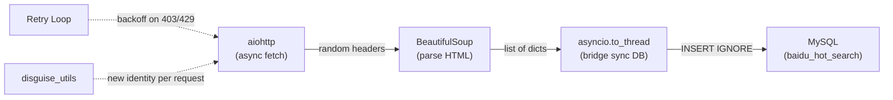

# 📚 Baidu DA Project — 3-Week Knowledge Library

> **Author:** Iverson Chen  
> **Period:** Feb 9 – Mar 9, 2026  
> **Context:** UCLA MGMTMSA 402 + Baidu Hot Search Data Pipeline + Douban Top250

---

## 📑 Table of Contents

| Section | Topic |
|---|---|
| [Architecture](#-final-architecture) | Project structure & data flow |
| **Week 1** | |
| [Phase 1](#-phase-1-mysql-installation--server-config) | MySQL installation & config |
| [Phase 2](#-phase-2-database-design--normalization) | Normalization theory |
| [Phase 3](#-phase-3-sql-fundamentals) | DDL, DML, data types |
| [Phase 4](#-phase-4-python--mysql-pep-249) | Python DB-API & venv |
| [Phase 5](#-phase-5-connection-pooling--transactions) | Pooling, Singleton, ACID |
| [Phase 6](#-phase-6-project-organization) | Package structure |
| **Week 2** | |
| [Phase 7](#-phase-7-http-fundamentals) | HTTP basics |
| [Phase 8](#-phase-8-html-parsing) | BeautifulSoup & CSS selectors |
| [Phase 9](#-phase-9-async-programming) | asyncio & aiohttp |
| [Phase 10](#-phase-10-anti-detection--resilience) | Stealth & backoff |
| [Phase 11](#-phase-11-final-pipeline) | Full ETL pipeline |
| **Week 3** | |
| [Phase 12](#-phase-12-oop-refactoring--testing) | BaseScraper inheritance, abstract methods, pytest |
| [Phase 13](#-phase-13-douban-top250--offline-scraping) | Douban anti-crawl, offline architecture, DOM parsing |
| **Week 4** | |
| [Phase 15](#-phase-15-data-cleaning--schema-normalization) | PyArrow, vectorization, 1NF fix, data validation |
| [Phase 16](#-phase-16-eda--distribution-analysis) | Seaborn, histograms, KDE, skewness, ANOVA readiness |
| **Reference** | |
| [Code Patterns](#-reusable-code-patterns) | Singleton, context mgr, backoff, inheritance… |
| [Mistakes](#-mistakes--lessons-learned) | 20+ real debugging sessions |
| [Q&A](#-questions-i-asked--answers) | 15+ gaps identified & filled |
| [Debugging](#-debugging-playbook) | Step-by-step troubleshooting |
| [Checklist](#-production-readiness) | Done ✅ vs future ☐ |

---

## 🏗 Final Architecture

```
baidu_da/
├── config/
│   └── db_config.ini           ← MySQL creds (gitignored)
├── database/
│   └── schema.sql              ← Table definitions (normalized)
├── utils/
│   ├── __init__.py
│   ├── mysql_helper.py         ← Singleton pool + transactions
│   ├── disguise_utils.py       ← Random headers
│   └── proxy_mgr.py            ← Proxy rotation (placeholder)
├── scrapers/
│   ├── baidu_hotsearch.py      ← v1: Sync
│   ├── baidu_async.py          ← v2: Async
│   ├── deep_scrape.py          ← v3: Concurrent pages
│   ├── stealth_scrape.py       ← v4: + Disguise
│   ├── smart_scrape.py         ← v5: + Retry/backoff
│   ├── baidu_pipe.py           ← FINAL pipeline
│   ├── base_scraper.py         ← OOP base class (async fetch + retry)
│   ├── douban_top250.py        ← Douban downloader (Phase 1: fetch → save HTML)
│   └── douban_parser.py        ← Douban parser (Phase 2: offline parse + normalized insert)
├── data/
│   ├── db_top250_raw/          ← 10 raw HTML files (offline cache)
│   └── data_cleaning.py        ← Pandas cleaning pipeline (PyArrow + vectorized)
├── tests/
└── venv/
```

**Data flows like this:**



---

---

# 🗓 Week 1 — MySQL, Database Theory & Python Integration

---

## 🔧 Phase 1: MySQL Installation & Server Config

> ★★★★☆ — Do once, reference forever.

**Setup commands:**

```bash
brew install mysql                # Homebrew for Apple Silicon
mysql_secure_installation         # Set root password, harden security
brew services start mysql         # Start the engine
brew services restart mysql       # Apply my.cnf changes
```

**Production tuning** — edit `/opt/homebrew/etc/my.cnf`:

```ini
[mysqld]
innodb_flush_log_at_trx_commit = 1    # ⭐ Durability: flush every commit
max_connections = 1000                 # Default 151 is too low
innodb_buffer_pool_size = 18G         # RAM > disk I/O
innodb_redo_log_capacity = 2G         # Buffer for write-heavy loads
character_set_server = utf8mb4        # 4-byte UTF-8 (emoji-safe 🔥)
```

> 💡 **Why `utf8mb4`?** MySQL's legacy `utf8` only supports 3 bytes. Emoji like 🔥 needs 4 bytes and will crash without `utf8mb4`.

**Create a dedicated app user** (never use `root` in code):

```sql
CREATE USER 'baidu_da'@'localhost' IDENTIFIED BY 'Complex_Password_123!';
GRANT ALL PRIVILEGES ON *.* TO 'baidu_da'@'localhost';
FLUSH PRIVILEGES;
```

---

## 📐 Phase 2: Database Design & Normalization

> ★★★★★ — Gets asked in interviews. Core of relational thinking.

**The Normal Forms** — remember: *"The key, the whole key, and nothing but the key."*

| Form | One-Liner Rule | Example Violation |
|---|---|---|
| **1NF** | Every cell holds one value | `"LA, 555-0199"` in one column |
| **2NF** | No partial dependency on composite key | `course_name` depends only on `course_id`, not full key `(student_id, course_id)` |
| **3NF** | No column depends on another non-key column | `school_address` depends on `school_name`, not on `student_id` |
| **BCNF** | Every determinant is a superkey | Strictest — eliminates all FD redundancy |

**How to fix violations:** Extract the offending columns into their own table and link with a Foreign Key.

**Key hierarchy:**

- **Superkey** — any set of columns that uniquely identifies a row (can have extras)
- **Candidate Key** — a *minimal* superkey (remove any column and it stops working)
- **Primary Key** — the candidate key you pick (non-null, unique)

**When to normalize vs. denormalize:**

| | OLTP (MySQL) | OLAP (BigQuery) |
|---|---|---|
| Goal | Fast writes, data integrity | Fast reads, analytics |
| Design | Normalized (3NF/BCNF) | Denormalized / star schema |

---

## 📝 Phase 3: SQL Fundamentals

> ★★★★★ — You'll use this daily.

### ⚠️ The DECIMAL vs FLOAT Trap

- **`FLOAT`** = approximate → `0.1 + 0.2 = 0.30000000000000004`
- **`DECIMAL(M,D)`** = exact → `0.1 + 0.2 = 0.3`

> 🚨 **Rule:** Never use `FLOAT` for money, GPA, or measurements. Always `DECIMAL`.

### Schema example (3NF):

```sql
CREATE TABLE student (
    id INT AUTO_INCREMENT PRIMARY KEY,
    school_id INT,
    name VARCHAR(50) NOT NULL,
    age TINYINT UNSIGNED,        -- 0–255, saves space
    height_cm DECIMAL(5,2),      -- Exact: 178.50
    enrollment_date DATE,
    FOREIGN KEY (school_id) REFERENCES school(id)
);
```

### Transactions:

```sql
START TRANSACTION;
  INSERT INTO school (name, address) VALUES ('UCLA', 'Los Angeles, CA');
  INSERT INTO student (school_id, name) VALUES (1, 'Iverson Chen');
COMMIT;       -- ✅ Save permanently
-- ROLLBACK;  -- ❌ Undo everything
```

---

## 🐍 Phase 4: Python + MySQL (PEP 249)

> ★★★★★ — Standard interface for all Python DB drivers.

### How the pieces connect:

```
Your Python Code
      ↓ cursor.execute(sql)
   Cursor     ← cheap "messenger", auto-close with `with`
      ↓
  Connection   ← expensive TCP pipe, open once and reuse
      ↓
 MySQL Server
```

- Use **`DictCursor`** → rows come back as `dict` (readable), not `tuple`

### Virtual environment (mandatory on modern macOS):

```bash
python3 -m venv venv
source venv/bin/activate
pip install pymysql dbutils
```

> 💡 macOS blocks global `pip install` (PEP 668). You **must** use a venv.

### Connection config:

```python
config = {
    'host': '127.0.0.1',      # Use IP, not 'localhost' (avoids socket errors)
    'user': 'baidu_da',
    'password': 'Your_Password',
    'database': 'your_db',
    'cursorclass': pymysql.cursors.DictCursor
}
```

---

## ⚡ Phase 5: Connection Pooling & Transactions

> ★★★★★ — The jump from "works on my laptop" to production.

### Why pool connections?

- ❌ **Short connections:** Open → query → close every time = slow (TCP handshake each time)
- ✅ **Connection pool:** Pre-open N connections, reuse them = fast & controlled

### ACID — the 4 guarantees of reliable databases:

| Letter | Meaning | How MySQL does it |
|---|---|---|
| **A**tomicity | All-or-nothing | `COMMIT` / `ROLLBACK` |
| **C**onsistency | Always valid state | Constraints & FKs |
| **I**solation | Concurrent txns don't clash | Locking / MVCC |
| **D**urability | Committed data survives crashes | Redo log flush |

### Singleton pattern — only one pool ever:

- **`__new__`** = *creates* the object (the gate — "do we already have one?")
- **`__init__`** = *initializes* the object (sets attributes)

### Context managers — the "sandwich" pattern:

```python
@contextmanager
def transaction(self):
    conn = self.pool.connection()   # 🍞 Top: Setup
    cursor = conn.cursor()
    try:
        yield cursor                # 🥩 Middle: hand resource to caller
        conn.commit()               #    (auto-commit if no error)
    except Exception as e:
        conn.rollback()             # 🍞 Bottom: Teardown on failure
        raise e
    finally:
        cursor.close()
        conn.close()
```

### `.ini` config — credentials ≠ logic:

Store secrets in `config/db_config.ini`, parse with `configparser`. Switch environments without touching code.

---

## 📦 Phase 6: Project Organization

> ★★★★☆ — Clean structure = maintainable project.

What was done:
- Moved flat root scripts into `scrapers/`, `utils/`, `tests/`, `database/`
- Added `__init__.py` to each folder (turns them into Python packages)
- Fixed all imports: `from disguise_utils` → `from utils.disguise_utils`
- Validated with `python -m py_compile scrapers/*.py`

---

---

# 🗓 Week 2 — Web Scraping, Async & Production Pipeline

---

## 🌐 Phase 7: HTTP Fundamentals

> ★★★★★ — HTTP is the language of the web.

| Concept | What to know |
|---|---|
| **Request** | Your script asks the server for a page |
| **Response** | Server sends back HTML + a status code |
| **Headers** | Metadata on the "envelope" — servers check these to detect bots |
| **User-Agent** | Identifies who's asking. Default `python-requests/2.31.0` = **instant ban** |

**Key status codes:**

| Code | Meaning | Your response |
|---|---|---|
| `200` | OK | Parse the HTML |
| `403` | Forbidden | You've been detected — back off |
| `429` | Too Many Requests | Slow down — exponential backoff |
| `503` | Service Unavailable | Server overloaded — retry later |

> 🚨 **HTTP 200 ≠ success.** Server can return 200 with stripped anti-bot HTML. Always check the *content*, not just the status.

---

## 🔍 Phase 8: HTML Parsing

> ★★★★☆ — Pattern-match your way through the DOM.

**The DOM** = HTML is a nested tree: `<html> → <body> → <div> → <span>`.  
**CSS Selectors** navigate this tree to find elements.

| What you want | Syntax | Example |
|---|---|---|
| Element by class | `.className` | `soup.select(".hot-index_1Bl1a")` |
| Specific tag + class | `tag.className` | `span.title-content-title` |
| All matches (list) | `select()` | Loop over items |
| First match (single) | `select_one()` | Grab one element |
| Text content | `.get_text(strip=True)` | `"  Topic  "` → `"Topic"` |
| Attribute value | `['href']` | `item.select_one("a")["href"]` |

---

## 🔄 Phase 9: Async Programming

> ★★★★★ — Essential when fetching many pages at once.

### Core concepts (with analogies):

| Keyword | What it does | Think of it as… |
|---|---|---|
| `async def` | Declares a pauseable function | A recipe that can pause mid-step |
| `await` | Pauses *this* task, lets others run | A buzzer — wakes you when ready |
| `asyncio.run()` | Starts the Event Loop | The ignition key |
| `ClientSession` | Async HTTP client | A browser tab that stays open |
| `asyncio.gather()` | Run tasks concurrently | Starting all engines at once |
| `Semaphore(n)` | Cap at N concurrent tasks | A turnstile — only 5 at a time |

### ⚠️ The sleep trap:

| ❌ Wrong | ✅ Right |
|---|---|
| `time.sleep(2)` — freezes **everything** | `await asyncio.sleep(2)` — pauses only **this** task |

### When to use async:

- ✅ Fetching 30+ pages concurrently → huge speed gain
- ❌ Single page fetch → async just adds complexity

### `async with` = same as `with`, but the open/close involves network I/O

### Bridging sync ↔ async with `asyncio.to_thread()`:

When you have a sync library (like `pymysql`) inside async code:

```python
def _insert():                        # Sync function
    with db.transaction() as cursor:
        for item in data_list:
            cursor.execute(sql, params)

await asyncio.to_thread(_insert)      # Runs in thread pool, doesn't block event loop
```

---

## 🛡 Phase 10: Anti-Detection & Resilience

> ★★★★☆ — What makes a scraper production-ready.

| Layer | What it does | How |
|---|---|---|
| **Header rotation** | Look like a different browser each time | `fake_useragent` + Sec-Fetch-* headers |
| **Random delays** | Don't hit the server like a machine | `await asyncio.sleep(random.uniform(1, 3))` |
| **Exponential backoff** | Wait longer after each failure | `wait = 2^(attempt+1) + jitter` |
| **Proxy rotation** | Different IP each request | `proxy=` param in `session.get()` |
| **Semaphore** | Don't overwhelm the server | `asyncio.Semaphore(5)` |

> 💡 **WAF** = Web Application Firewall — the server's bouncer.  
> 💡 **TLS Fingerprinting** = even with perfect headers, Python's HTTPS handshake looks different from Chrome's. Fix: use `httpx` or Playwright.

---

## 🚀 Phase 11: Final Pipeline

> ★★★★★ — Everything comes together.

### Database integration patterns:

| Pattern | Why |
|---|---|
| `INSERT IGNORE` | Skips duplicates silently → safe to re-run (**idempotent**) |
| `UNIQUE KEY (title, created_at)` | Only one entry per title per day |
| `CURDATE()` | MySQL handles the date → timezone-consistent |
| `%s` placeholders | Data is never executed as SQL → **injection-proof** |

### ⚠️ Module execution rule:

```bash
# ❌ BREAKS cross-package imports:
python3 scrapers/baidu_pipe.py

# ✅ WORKS — sets import root to project directory:
python -m scrapers.baidu_pipe
```

---

---

# 🗓 Week 3 — OOP Refactoring, Testing & Douban Top250

---

## 🏛 Phase 12: OOP Refactoring & Testing

> ★★★★★ — Turns scripts into a scalable framework.

### Why refactor to OOP?

Before: every scraper was a standalone script with copy-pasted fetch/retry logic.  
After: one `BaseScraper` class holds shared logic, each scraper only implements what's unique.

### `BaseScraper` — the abstract base:

```python
class BaseScraper:
    def __init__(self, url, retries=5, timeout=10):
        self.url = url
        self.retries = retries
        self.timeout = timeout

    async def fetch(self):       # Shared: async fetch + retry + backoff
        ...

    def parse(self, html):       # Abstract: subclass MUST implement
        raise NotImplementedError('Subclasses must implement parse()')

    async def run(self):         # Template: fetch → parse
        html = await self.fetch()
        return self.parse(html) if html else None
```

### Key OOP concepts used:

| Concept | What it does | Example |
|---|---|---|
| **Inheritance** | Child class gets parent's methods | `class BaiduHotSearchScraper(BaseScraper)` |
| **`super().__init__()`** | Calls parent's `__init__` to set shared attrs | `super().__init__(url="https://...", **kwargs)` |
| **Abstract method** | Forces subclasses to implement a method | `raise NotImplementedError` in `parse()` |
| **`**kwargs` forwarding** | Pass remaining args to parent | `def __init__(self, **kwargs): super().__init__(**kwargs)` |
| **Method override** | Child replaces parent's method | `DoubanTop250.fetch_page()` adds cookies |

### How `BaiduHotSearchScraper` inherits:

```python
class BaiduHotSearchScraper(BaseScraper):
    def __init__(self, **kwargs):
        super().__init__(url="https://top.baidu.com/board?tab=realtime", **kwargs)

    def parse(self, html):       # Only implements the unique part
        soup = BeautifulSoup(html, 'html.parser')
        # ... parsing logic specific to Baidu
```

> 💡 `BaiduHotSearchScraper` inherits `fetch()`, `run()`, `retries`, `timeout` from `BaseScraper` — zero code duplication.

### pytest — testing async code:

```python
import pytest
from scrapers.base_scraper import BaseScraper

class TestBaseScraper:
    def test_init_stores_attributes(self):
        scraper = BaseScraper("https://example.com")
        assert scraper.url == "https://example.com"

    def test_parse_raises_not_implemented(self):
        scraper = BaseScraper("https://example.com")
        with pytest.raises(NotImplementedError):   # Expects the error
            scraper.parse("<html></html>")

    @pytest.mark.asyncio                           # Enables await in tests
    async def test_fetch_success(self):
        scraper = BaseScraper("https://www.baidu.com")
        html = await scraper.fetch()
        assert html is not None
```

**Run tests:** `python -m pytest tests/ -v`

| pytest concept | What it does |
|---|---|
| `assert` | Verify expected == actual |
| `pytest.raises(ErrorType)` | Verify code throws an expected error |
| `@pytest.mark.asyncio` | Allows `async def` test functions |
| `-v` flag | Verbose output (shows each test name) |

---

## 🎬 Phase 13: Douban Top250 — Offline Scraping & Download

> ★★★★★ — Anti-crawling, offline architecture, and DOM deep-dive.

### Core concept: "Download first, parse later"

```
Phase 1 (douban_top250.py):              Phase 2 (douban_parser.py):
Network → save HTML files                Local files → BeautifulSoup → data
   ↓ runs once, with delays                ↓ runs unlimited, 0 network risk
   data/db_top250_raw/page_0.html         [{rank, title, rating, ...}, ...]
   data/db_top250_raw/page_1.html
   ...
```

**Why separate?** Bug in parser → just re-run locally. No extra network requests → no IP ban risk.

### Anti-crawling: Douban's `bid` Cookie

| Defense layer | How Douban detects you | Our countermeasure |
|---|---|---|
| `bid` Cookie | No browser ID = instant 418 | Pass `cookies={"bid": "..."}` to `ClientSession` |
| Rate limiting | >6 pages fast = "禁止访问" | `random.uniform(5, 10)` between pages |
| Content-level block | Returns 200 but blocked HTML | `valid_html()` checks for `rating_num` in content |
| User-Agent | Default Python UA = bot | `fake_useragent` (already had from Phase 10) |

> 🚨 **Key lesson:** HTTP 200 ≠ valid content. Douban returns 200 with a "禁止访问" page. Always validate HTML content, not just status code.

### Pagination pattern:

```python
# 10 pages × 25 movies = 250 total
urls = [f"https://movie.douban.com/top250?start={i * 25}" for i in range(10)]
```

### CSS selectors for Douban Top250:

| Data | Selector | Notes |
|---|---|---|
| Movie container | `ol.grid_view > li` | 25 per page |
| Rank | `div.pic > em` | → `int()` |
| Title (Chinese) | `span.title` (first) | `.get_text(strip=True)` |
| Rating | `span.rating_num` | → `float()` |
| Review count | `find('span', string=re.compile(r'人评价'))` | No class, use regex match |
| Quote | `p.quote span` | May not exist → null-safe |
| Director/year/genre | `div.bd p` (first) | Mixed text, cleaned with regex in Phase 14 |

### File-level validation (skip already-downloaded pages):

```python
if os.path.exists(filepath) and os.path.getsize(filepath) > 50000:
    print('Already valid, skipping')  # 60KB = real page, 11KB = blocked page
    continue
```

### Result: All 250 movies downloaded (10 pages).

Pages 7-10 initially blocked by IP rate limit — resolved by switching to a fresh `bid` cookie from a different browser.

---

## 🔧 Phase 14: Regex Cleaning, Schema Design & MySQL Loading

> ★★★★★ — Regex deep-dive, DECIMAL precision, and complete ETL.

### Regex for cleaning `movie_info`

Raw text: `"导演: 弗兰克·德拉邦特 Frank Darabont\xa0\xa0\xa0主演: 蒂姆·罗宾斯...1994\xa0/\xa0美国\xa0/\xa0犯罪 剧情"`

| Field | Method | Key concept |
|---|---|---|
| Director | `r'导演:\s*(.*?)(?:\s*主演|\.\.\.)` | `(?:...)` = non-capturing group, handles truncated text |
| Year | `r'(\d{4})'` | `\d{4}` = exactly 4 digits |
| Country | `movie_info.split('/')[-2].strip()` | Split by `/`, take second-to-last segment |
| Genre | `movie_info.split('/')[-1].strip()` | Split by `/`, take last segment |

> 🔄 **Refactored in Phase 15:** Country/genre extraction changed from regex to `split('/')` to handle edge cases like `1961(中国大陆) / 1964(中国大陆) / 1978(中国大陆) / 中国大陆 / 剧情`.

### `.*` (greedy) vs `.*?` (lazy):

| Mode | Behavior | Analogy |
|---|---|---|
| `.*` (greedy) | Eat everything, then backtrack right-to-left | Buffet: pile plate high, put excess back |
| `.*?` (lazy) | Eat one char, check if next condition matches | Cautious: take one, check, take another |

### Null-safe regex pattern:

```python
director_match = re.search(r'导演:\s*(.*?)\s*主演', movie_info)
director = director_match.group(1).strip() if director_match else None
```

### MySQL Schema: `DECIMAL` vs `FLOAT`

```sql
rating DECIMAL(2,1) NOT NULL   -- M=2 total digits, D=1 decimal → X.X → max 9.9
```

| `DECIMAL(M,D)` | Format | Max value | Use case |
|---|---|---|---|
| `DECIMAL(2,1)` | `X.X` | 9.9 | Movie rating |
| `DECIMAL(3,2)` | `X.XX` | 9.99 | GPA |
| `DECIMAL(10,2)` | `XXXXXXXX.XX` | 99999999.99 | Money |

### `UNIQUE KEY` vs `PRIMARY KEY`:

- **PRIMARY KEY (`id`)** = auto-increment row identifier, internal
- **UNIQUE KEY (`rank_idx`)** = business constraint — no duplicate ranks
- Together with `INSERT IGNORE` → idempotent, safe to re-run

### Complete ETL pipeline:

```
E (Extract):   douban_top250.py  → 10 HTML files in data/db_top250_raw/
T (Transform): douban_parser.py  → BeautifulSoup + regex → 250 movie dicts
L (Load):      to_db()           → INSERT IGNORE into MySQL douban_top250
```

### Result: 250 movies × 10 fields inserted into MySQL.

---

---

# 🗓 Week 4 — Data Cleaning, Validation & Schema Normalization

---

## 🧹 Phase 15: Data Cleaning & Schema Normalization

> ★★★★★ — Turns raw scraped data into analysis-ready data.

### Schema Normalization: Fixing the 1NF Violation

**Problem:** `genre` and `country` columns stored multiple values like `"犯罪 剧情"` and `"中国大陆 中国香港"` — violates First Normal Form.

**Solution:** Created junction tables:

```sql
CREATE TABLE movie_genres (
    id INT AUTO_INCREMENT PRIMARY KEY,
    movie_id INT NOT NULL,
    genre VARCHAR(50) NOT NULL,
    FOREIGN KEY (movie_id) REFERENCES douban_top250(id) ON DELETE CASCADE,
    UNIQUE KEY unique_movie_genre (movie_id, genre)
);

CREATE TABLE movie_countries (
    id INT AUTO_INCREMENT PRIMARY KEY,
    movie_id INT NOT NULL,
    country VARCHAR(100) NOT NULL,
    FOREIGN KEY (movie_id) REFERENCES douban_top250(id) ON DELETE CASCADE,
    UNIQUE KEY unique_movie_country (movie_id, country)
);
```

| Concept | Meaning |
|---|---|
| **Junction table** | Links two entities in a many-to-many relationship |
| **`ON DELETE CASCADE`** | Deleting a movie auto-deletes its genres/countries |
| **`LAST_INSERT_ID()`** | Returns the auto-generated `id` from the most recent INSERT |

**Result:** `douban_top250` (250 rows) + `movie_genres` (700 rows) + `movie_countries` (373 rows).

### Parser fix: `to_db()` now inserts to 3 tables

```python
for movie in movies:
    cursor.execute(movie_query, (...))           # 1. Insert movie
    cursor.execute('SELECT LAST_INSERT_ID() AS id')
    movie_id = cursor.fetchone()[0]               # 2. Get auto-generated id
    for genre in movie['genre'].split():          # 3. Insert each genre
        cursor.execute(genre_query, (movie_id, genre))
    for country in movie['country'].split():      # 4. Insert each country
        cursor.execute(country_query, (movie_id, country))
```

### Pandas Data Cleaning Pipeline

**Core tools:**

| Tool | What It Does |
|---|---|
| `pd.read_sql(sql, engine)` | Load SQL results into a DataFrame |
| `df.convert_dtypes(dtype_backend='pyarrow')` | Switch to PyArrow backend |
| `df.select_dtypes(include='string')` | Pick columns by type |
| `df['col'].str.strip()` | Vectorized whitespace removal |
| `pd.to_numeric(col, errors='coerce')` | Convert to numbers, failures → `<NA>` |
| `pd.to_numeric(col, downcast='integer')` | Use smallest int type that fits |
| `df.duplicated(subset=[...])` | Find duplicate rows |
| `df.memory_usage(deep=True)` | Check memory per column |

### PyArrow Backend — Why it matters

| Feature | NumPy (old) | PyArrow (new) |
|---|---|---|
| Missing integers | Forces column → `float64` | Stays `int64[pyarrow]` |
| Missing marker | `np.nan` (float) | `pd.NA` (type-agnostic) |
| String storage | Python objects (slow) | Columnar (fast) |

### Vectorization — Professional data processing

**Never** use `for` loops or `.iterrows()` on DataFrames. Vectorized ops are 100–2500× faster.

```python
# ❌ Slow: Python loop
for i in range(len(df)):
    df.loc[i, 'rating'] = df.loc[i, 'rating'] * 2

# ✅ Fast: Vectorized (delegated to C under the hood)
df['rating'] = df['rating'] * 2
```

### 3σ Outlier Detection

99.7% of data falls within `mean ± 3 × std`. Anything outside is likely an error.

```python
mean, std = df['rating'].mean(), df['rating'].std()
outliers = df[(df['rating'] < mean - 3*std) | (df['rating'] > mean + 3*std)]
```

**Result:** 3σ range [8.15, 9.74], 0 outliers found.

### Memory Optimization

| Technique | How |
|---|---|
| **Downcasting** | `pd.to_numeric(col, downcast='integer')` — picks `int32` instead of `int64` if values fit |
| **Chunksize** | `pd.read_sql(sql, engine, chunksize=10000)` — load in batches for huge tables |

**Result:** 44.2 KB → 41.7 KB (−5.7%). Small on 250 rows, significant at millions.

### OLTP → OLAP mindset shift

| | OLTP (Weeks 1–3) | OLAP (Week 4+) |
|---|---|---|
| Focus | Writing & managing data | Reading & analyzing data |
| Operations | INSERT, UPDATE, DELETE | SELECT, GROUP BY, aggregations |
| Tools | pymysql, scrapers | Pandas, PyArrow |

## 📊 Phase 16: EDA & Distribution Analysis

> ★★★★★ — The bridge between data cleaning and hypothesis testing.

### What is EDA?

**Exploratory Data Analysis (EDA)** = using statistics and visualizations to understand your data's shape, patterns, and anomalies *before* running formal tests. Think of it as "getting to know your data" before asking it questions.

### Tools Used

| Tool | Purpose |
|---|---|
| `pandas` | Load data, compute statistics (`describe()`, `mean()`, `skew()`) |
| `seaborn` | High-level statistical plotting (histplot, kdeplot, countplot) |
| `matplotlib.pyplot` | Underlying plot engine (`figure()`, `savefig()`, `show()`) |

> ⚠️ Import `matplotlib.pyplot as plt`, NOT `matplotlib as plt`. The `pyplot` submodule has the plotting functions.

### Action 16.1: Descriptive Statistics

```python
df = pd.read_parquet('data/douban_top250_cleaned.parquet')
print(df[['rating', 'year', 'rating_count']].describe())

mean_rating = df['rating'].mean()      # 8.95
median_rating = df['rating'].median()  # 8.90
# Difference: 0.05 → nearly symmetric distribution
```

**Key findings:**

| Metric | Value | Insight |
|---|---|---|
| Rating range | 8.4 – 9.7 | Only 1.3-point spread across all 250 top movies |
| Rating std | 0.26 | Extremely tight clustering |
| Mean vs Median | 8.95 vs 8.90 | Difference of 0.05 → nearly symmetric |
| Year median | 2004 | Half of top movies are post-2004 (recency bias) |
| Year 25th pct | 1994 | 75% of top movies come from 1994 or later |

**Mean vs Median rule:**
- Mean > Median → right-skewed (tail towards high values)
- Mean < Median → left-skewed (tail towards low values)
- Mean ≈ Median → roughly symmetric

### Action 16.2: Decade Distribution Histogram

```python
# Integer division trick: 1994 → 1990, 2008 → 2000
df['decade'] = df['year'] // 10 * 10

plt.figure(figsize=(12, 6))
sns.countplot(data=df, x='decade')
plt.title('Douban Top 250: Movies by Decade')
plt.savefig('data/decade_distribution.png', dpi=150)
plt.show()
```

**Key findings:**

| Decade | Count | Note |
|---|---|---|
| 1930–1970 | 19 total | Very few — old classics |
| 1980s | 16 | Ramp-up begins |
| 1990s | 56 | Golden era (肖申克, 霸王别姬, 阿甘正传) |
| 2000s | 75 | Peak era |
| 2010s | 80 | Top decade — 32% of all top 250 |
| 2020s | 4 | Decade just started |

> ⚠️ **Survivorship bias:** This doesn't mean 2010s movies are "better". Douban's young user base rates newer movies more.

### Action 16.3: KDE Curve & Skewness

**KDE (Kernel Density Estimation)** = a smoothed version of a histogram. Places a small bell curve at each data point and stacks them → reveals the true shape of the distribution.

```python
plt.figure(figsize=(12, 6))
sns.histplot(data=df, x='rating', bins=13, kde=True)
plt.savefig('data/rating_kde.png', dpi=150)
plt.show()

skewness = df['rating'].skew()  # 0.4365
```

**Skewness decision framework:**

| Skewness Range | Interpretation | ANOVA Safe? |
|---|---|---|
| \|skew\| < 0.5 | Approximately symmetric | ✅ Yes |
| 0.5 ≤ \|skew\| < 1.0 | Moderately skewed | ⚠️ Proceed with caution |
| \|skew\| ≥ 1.0 | Highly skewed | ❌ Use Kruskal-Wallis instead |

**Result:** Skewness = 0.4365 (< 0.5) → **ANOVA is safe for Day 17 hypothesis testing.**

### Strategic Conclusion

| Analysis | Result | Implication |
|---|---|---|
| Mean ≈ Median | 8.95 ≈ 8.90 | Distribution nearly symmetric |
| Decade histogram | 84% from 1990–2019 | Modern-era bias (survivorship) |
| KDE + Skewness | 0.4365 < 0.5 | Parametric tests (ANOVA) are valid |

### Key Concepts Learned

| Concept | Definition |
|---|---|
| **Descriptive Statistics** | Summarize data with numbers: mean, median, std, percentiles |
| **Histogram** | Bar chart showing frequency of values in bins |
| **KDE** | Smooth curve estimating the probability density of continuous data |
| **Skewness** | Measures asymmetry: 0 = symmetric, positive = right-tail, negative = left-tail |
| **ANOVA** | Tests if group means differ significantly (requires ~normal distribution) |
| **Kruskal-Wallis** | Non-parametric alternative to ANOVA (no normality assumption) |
| **Survivorship Bias** | Drawing conclusions only from "survivors" ignores the failures |
| **OLTP vs OLAP** | OLTP = transactional writes; OLAP = analytical reads & aggregations |
| **Parquet** | Columnar file format — faster reads & better compression than CSV |

---

# 📎 Reference

---

## 🧩 Reusable Code Patterns

| Pattern | Where used | What it does |
|---|---|---|
| **Singleton** | `MysqlHelper.__new__()` | Ensures only one connection pool exists |
| **Context Manager** | `get_cursor()`, `transaction()` | Setup → yield → guaranteed cleanup |
| **Transaction wrapper** | `transaction()` | Auto-commit on success, auto-rollback on error |
| **Exponential backoff** | `baidu_pipe.py` | `2^n + jitter` wait after 403/429/503 |
| **Null-safe parsing** | All CSS selectors | `el.get_text() if el else 'N/A'` |
| **INSERT IGNORE + UNIQUE** | `to_db()` | Idempotent — safe to re-run |
| **Inner func + `to_thread`** | `to_db()` | Bridges sync DB code into async |
| **`if __name__`** | All scripts | Prevents execution on import |
| **`enumerate(_, 1)`** | Scraper loop | Index + item, starting at 1 |
| **Offline scraping** | `douban_top250.py` + `douban_parser.py` | Download HTML → local files → parse offline |
| **Content validation** | `valid_html()` | Check HTML contains expected data, not just 200 OK |
| **File-size skip** | `download_all()` | Skip re-downloading pages >50KB (already valid) |
| **`find(string=re.compile())`** | `douban_parser.py` | Find elements by text content when no class exists |
| **Lazy regex `.*?`** | `clean_movie_info()` | Stop at first match, not last. Must pair with terminator |
| **Null-safe regex** | `clean_movie_info()` | `match.group(1) if match else None` prevents NoneType crash |
| **`dict.update()`** | `parse_page()` | Merge cleaned fields into existing movie dict |
| **`.ini` config** | `db_config.ini` | Secrets separate from code |
| **Inheritance + abstract methods** | `BaseScraper` → `BaiduHotSearchScraper`, `DoubanTop250` | Shared fetch/retry in parent, unique parsing in child |
| **`super().__init__()`** | All child scrapers | Forward args to parent class |
| **`NotImplementedError`** | `BaseScraper.parse()` | Force subclass to implement |
| **pytest + `@pytest.mark.asyncio`** | `tests/test_base_scraper.py` | Unit test async code with `assert` |
| **`LAST_INSERT_ID()`** | `to_db()` | Get auto-generated id after INSERT for junction table inserts |
| **Junction tables** | `movie_genres`, `movie_countries` | Normalize many-to-many relationships (1NF) |
| **`ON DELETE CASCADE`** | FK constraint | Auto-delete child rows when parent is deleted |
| **`split('/')` over regex** | `clean_movie_info()` | Simpler and more robust when delimiter is consistent |
| **Boolean indexing** | `data_cleaning.py` | `df[df['rating'] > 9]` — filter rows with a mask |
| **PyArrow backend** | `data_cleaning.py` | `convert_dtypes(dtype_backend='pyarrow')` — fixes NaN type coercion |
| **Downcasting** | `data_cleaning.py` | `pd.to_numeric(col, downcast='integer')` — memory optimization |

---

## 💥 Mistakes & Lessons Learned

> **The most valuable section** — each row is a real bug I hit.

### Week 1: MySQL & Python Setup

| # | 😰 What happened | 💡 Lesson learned |
|---|---|---|
| 1 | `mysql -u -root -p` → "Access denied for **-root**" | CLI spacing matters. Correct: `mysql -u root -p` |
| 2 | `pip install` → "externally-managed-environment" | macOS blocks global pip. **Always use a venv.** |
| 3 | INSERT worked, but data vanished after disconnect | **Forgot `commit()`.** InnoDB treats changes as drafts. |
| 4 | `CREATE USER` → ERROR 1819 | Password too simple. MySQL enforces complexity rules. |
| 5 | VS Code DB client couldn't connect | Used `localhost` → socket mismatch. Use `127.0.0.1` instead. |
| 6 | F-string crashed with dict keys | Quote collision. Fix: `f"{data['key']}"` (double outside, single inside) |

### Week 2: Scraping & Async

| # | 😰 What happened | 💡 Lesson learned |
|---|---|---|
| 7 | `range(retries = 3)` → SyntaxError | `range()` doesn't take keyword args. Define `retries` as a function param. |
| 8 | `hot_index_el` vs `hot_idx_el` → NameError | Typo in variable name. Python only catches this at runtime. |
| 9 | Code ran unexpectedly on import | `await` was at module level (bad indentation). **Indentation = scope.** |
| 10 | `print(result)` showed `None` | Function was missing a `return` statement. |
| 11 | Counter showed 30 inserts, but only 5 were new | Used `count += 1` instead of `count += cursor.execute()` (returns 0 for skipped dupes). |
| 12 | Second scrape → "No data" despite HTTP 200 | Baidu served anti-bot HTML. **Always validate content, not just status code.** |
| 13 | `if data_list:` missed the difference between `[]` and `None` | Both are falsy. Use: `if data_list:` / `elif data_list is None:` / `else:` |
| 14 | Cross-package imports broke | Ran `python file.py`. Fix: `python -m package.file` |

### Week 3: Douban Scraping

| # | 😰 What happened | 💡 Lesson learned |
|---|---|---|
| 15 | `class Foo(Base, **kwargs)` → SyntaxError | Class parentheses are for **parent classes only**, not arguments. `**kwargs` goes in `__init__`. |
| 16 | `cookies = {...}` → attribute not found later | Missing `self.` prefix = local variable that vanishes after `__init__`. |
| 17 | `save_html` only saved page 1 | `with open(...)` was indented inside `if not exists` → only ran when dir was created. |
| 18 | Pages 7-10 had 200 status but "禁止访问" content | Douban returns 200 OK with blocked HTML. Must validate **content**, not just status. |
| 19 | `div.star span` found nothing for review count | Actual HTML had `<div>` without class. Used `find(string=re.compile())` instead. |
| 20 | `quote_span.get_text()` → AttributeError: NoneType | `find()` returned `None` (no match). Always check `if element:` before `.get_text()`. |
| 21 | `movie_info.re.search(...)` → AttributeError | Wrong syntax. Correct: `re.search(pattern, string)`, not `string.re.search()`. |
| 22 | Used Chinese `（）` in regex instead of `()` | Regex uses ASCII `()` for capture groups. Chinese parentheses are literal characters. |

### Week 4: Data Cleaning & Normalization

| # | 😰 What happened | 💡 Lesson learned |
|---|---|---|
| 23 | Director regex failed for 10 movies | `主演` was truncated with `...`. Fixed: `(?:\s*主演|\.\.\.)` — match either terminator. |
| 24 | Country/genre regex failed for 2 movies (大闹天宫, 茶馆) | Multiple years `1961(中国大陆) / 1964(中国大陆)` broke regex. Fixed: switched to `split('/')` taking last 2 segments. |
| 25 | `cursor.fetchone()['id']` → `TypeError: tuple indices must be integers` | `MysqlHelper.transaction()` uses plain cursor (returns tuples), not `DictCursor`. Fix: use `[0]` not `['id']`. |
| 26 | Genre/country insertion was outside `for` loop (indentation bug) | Only ran for the last movie. **Indentation = control flow in Python.** |
| 27 | `len(movie)` instead of `len(movies)` in print | `movie` = last dict (10 keys), `movies` = full list (250 items). Always double-check plural. |
| 28 | `TRUNCATE TABLE` failed with FK constraint error | `execute_sql()` commits each statement separately. Must use `transaction()` to keep `SET FOREIGN_KEY_CHECKS = 0` in same session. |

---

## ❓ Questions I Asked & Answers

| # | Question | Answer | ★ |
|---|---|---|---|
| 1 | Why not f-strings for SQL? | They embed user input as executable code → SQL injection. `%s` sends data separately. | ★★★★★ |
| 2 | `__new__` vs `__init__`? | `__new__` creates the object (Singleton gate). `__init__` sets its attributes. | ★★★★☆ |
| 3 | When async vs sync? | Async for many concurrent I/O ops. Single request → sync is simpler, equally fast. | ★★★★★ |
| 4 | `time.sleep` vs `asyncio.sleep`? | `time.sleep` freezes everything. `asyncio.sleep` only pauses this coroutine. | ★★★★★ |
| 5 | Why does `commit()` exist? | Groups operations atomically. Without it, the DB rolls back partial changes. | ★★★★★ |
| 6 | `DECIMAL` vs `FLOAT`? | `FLOAT` is approximate (`0.1+0.2≠0.3`). `DECIMAL` is exact. | ★★★★☆ |
| 7 | What is WAF / TLS fingerprinting? | WAF = server firewall. TLS fingerprint = Python's handshake differs from Chrome's. | ★★★★☆ |
| 8 | `INSERT IGNORE` vs `INSERT`? | `INSERT IGNORE` skips duplicates silently → idempotent, safe to re-run. | ★★★★★ |
| 9 | `async with` vs `with`? | Same cleanup pattern, but open/close involves network I/O. | ★★★★☆ |
| 10 | `127.0.0.1` vs `localhost`? | `localhost` may try unix socket (path varies). `127.0.0.1` forces TCP. | ★★★☆☆ |
| 11 | Why 418 "I'm a Teapot"? | RFC 2324 April Fools joke. Douban reuses it as explicit bot-detection code. | ★★★★☆ |
| 12 | What is `bid` Cookie? | Browser ID — Douban's primary tracker. No `bid` = instant block. | ★★★★★ |
| 13 | Why offline parse architecture? | Separates network I/O from CPU parse. Debug parser without triggering anti-crawl. | ★★★★★ |
| 14 | `os.makedirs(exist_ok=True)` vs `if not exists`? | One line vs two, and avoids race conditions. The `if` approach also invited indentation bugs. | ★★★☆☆ |
| 15 | `find(string=re.compile())` vs `select()`? | `select()` matches by tag/class. `find(string=)` matches by **text content** — needed when element has no class. | ★★★★☆ |
| 16 | `.*` vs `.*?` in regex? | `.*` = greedy (eat all, backtrack). `.*?` = lazy (eat one, check). Lazy needs a terminator. | ★★★★★ |
| 17 | `DECIMAL(2,1)` — what do 2 and 1 mean? | M=total digits, D=decimal digits. `DECIMAL(2,1)` = `X.X`, max 9.9. | ★★★★☆ |
| 18 | UNIQUE KEY vs PRIMARY KEY? | PK = auto-increment row ID. UNIQUE = business constraint (no duplicate ranks). Both serve different purposes. | ★★★★☆ |
| 19 | Why PyArrow over NumPy? | NumPy has no missing integer concept — `NaN` forces `int→float`. PyArrow uses `pd.NA` which preserves types. | ★★★★★ |
| 20 | `python file.py` vs `python -m pkg.file`? | `-m` keeps project root as import path. Direct execution sets file's dir as root, breaking cross-package imports. | ★★★★★ |
| 21 | What is a junction table? | A table that links two entities in a many-to-many relationship (e.g. `movie_genres` links movies and genres). | ★★★★★ |
| 22 | What is `LAST_INSERT_ID()`? | MySQL function returning the auto-increment id from the most recent INSERT. Returns 0 if INSERT IGNORE skipped. | ★★★★☆ |
| 23 | What is the 3σ rule? | 99.7% of normally distributed data falls within mean ± 3 standard deviations. Outside = likely outlier. | ★★★★☆ |
| 24 | `TRUNCATE` vs `DELETE`? | `TRUNCATE` resets AUTO_INCREMENT, faster (no row-by-row). `DELETE` keeps counter, can use WHERE clause. | ★★★★☆ |
| 25 | What is downcasting? | Using smaller numeric types (e.g. `int32` instead of `int64`) to save memory. Matters at scale. | ★★★☆☆ |

---

## 🔎 Debugging Playbook

### Scraper returns 0 items but HTTP 200:

1. **Add prints at each stage** → "Found: 0? Parsed: 0?" narrows the failure
2. **Save raw HTML** → `with open('debug.html', 'w') as f: f.write(html)` → see what server actually sent
3. **Check error type** → `None` = network error · `[]` = CSS selectors broke · `[data]` = success
4. **Root cause:** Baidu served stripped anti-bot HTML after detecting repeated same-IP requests

### MySQL won't cooperate:

| Symptom | Fix |
|---|---|
| "Can't connect through socket" | `brew services start mysql` |
| "Access denied" | Check `mysql -u root -p` spacing |
| Data disappears after script | Add `connection.commit()` |
| "Too many connections" | Raise `max_connections` in `my.cnf`, restart |
| `ConnectionRefusedError` | Check port 3306, start service |

---

## ✅ Production Readiness

**Done:**
- [x] Random headers per request
- [x] Retry with exponential backoff + jitter
- [x] `INSERT IGNORE` + UNIQUE KEY
- [x] Parameterized queries (`%s`)
- [x] Transaction with auto-rollback
- [x] Connection pooling via Singleton
- [x] OOP base class (`BaseScraper`) with inheritance
- [x] pytest unit tests for scrapers
- [x] Null safety on all CSS selectors
- [x] `None` vs `[]` explicit distinction
- [x] Project organized into packages

**Next steps:**
- [ ] Replace `print()` with `logging` module
- [ ] Scheduled execution (cron job)
- [ ] Fully async DB with `aiomysql`
- [ ] Proxy rotation with residential IPs
- [ ] TLS fingerprint evasion (`httpx` / Playwright)
- [x] ~~Douban: re-download pages 7-10 after IP cooldown~~ (solved with fresh `bid`)
- [x] ~~Douban: regex clean `movie_info` → separate director, actors, year, country, genre~~
- [x] ~~Douban: store parsed data to JSON and/or MySQL~~ (250 rows in `douban_top250` table)
- [x] ~~Douban: normalize to 1NF~~ (genres → `movie_genres`, countries → `movie_countries`)
- [x] ~~Douban: data cleaning pipeline~~ (PyArrow, vectorization, dedup, domain checks, 3σ)
- [x] ~~Douban: EDA & distribution analysis~~ (descriptive stats, decade histogram, KDE, skewness=0.44 → ANOVA safe)
- [ ] Douban: hypothesis testing (ANOVA / Kruskal-Wallis on director groups)
- [ ] Douban: data analysis queries (top genres, avg rating by country, etc.)
